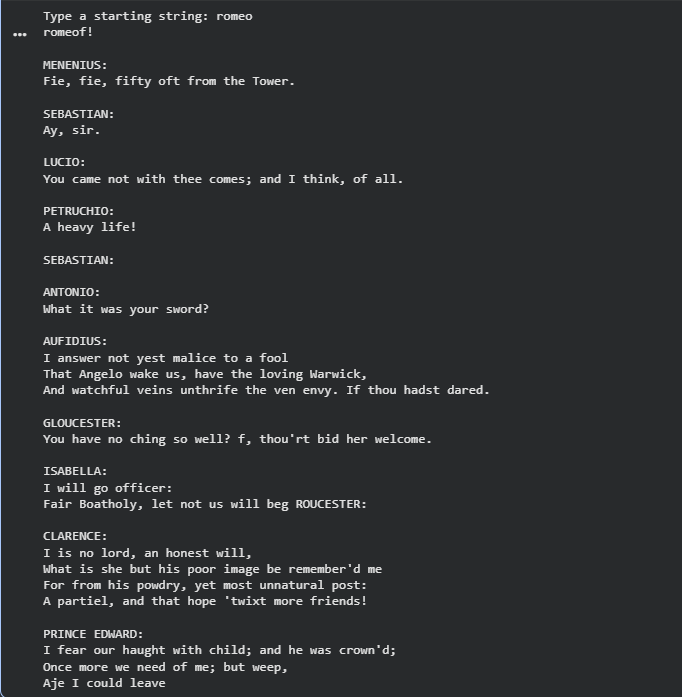
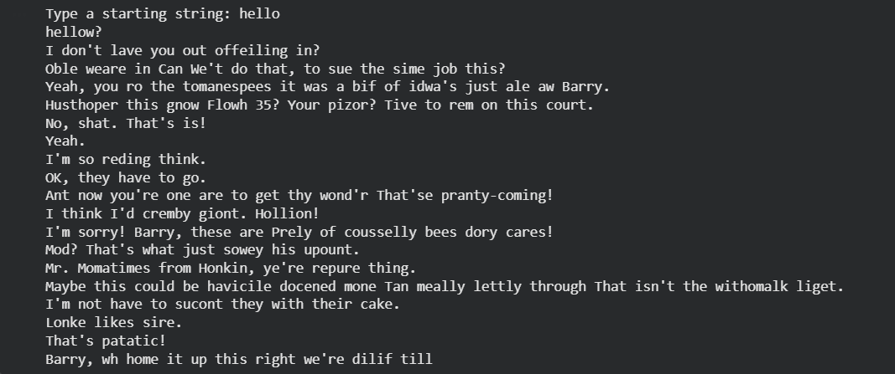

[](https://www.python.org/)[](https://www.tensorflow.org/)[](https://jupyter.org/)

---
# Text Generation with RNN

This project implements a **character-level Recurrent Neural Network (RNN)** using **TensorFlow** and **Keras** for text generation.  
Trained on both the **Shakespeare text corpus** and the **Bee Movie script**, the model predicts the next character in a sequence, allowing it to generate entire sentences and paragraphs with creative variation controlled via temperature-based sampling.

---
# 🧠 Table of Contents

- [Overview](#overview)
- [Datasets](#datasets)
- [Model Architecture](#model-architecture)
- [Training](#training)
- [Results](#results)
- [Dependencies](#dependencies)
- [Project Structure](#project-structure)
- [References](#references)

---
## Overview

This project implements a **character-level Recurrent Neural Network (RNN)** for text generation using **TensorFlow** and **Keras**.  
The model learns to predict the next character in a sequence, enabling it to generate coherent text in the style of the training dataset (e.g., Shakespeare, movie scripts, or any custom text corpus).

It demonstrates:
- How sequential data can be modeled using RNNs  
- Training workflow for character-based text generation  
- Temperature-based sampling for creative text diversity  

All training, model creation, and generation steps are done inside a single **Jupyter Notebook**, making it easy to visualize and experiment with.

---
## Datasets

This project uses two datasets for training the character-level RNN:

- **Shakespeare Text Corpus**  
  Classic works of Shakespeare used for generating literary-style text.  
  [Download Link](https://storage.googleapis.com/download.tensorflow.org/data/shakespeare.txt)  
  Also included in this repo: [`dataset/shakespeare.txt`](./dataset/shakespeare.txt)

- **Bee Movie Script**  
  Script of the Bee Movie, providing a casual, conversational dataset.  
  Included in this repo: [`dataset/bee_movie_script.txt`](./dataset/bee_movie_script.txt)

---
## Model Architecture

The text generation model is a **character-level RNN** built with **TensorFlow** and **Keras**.  

Below is the model summary diagram:


**Key Components:**
- **Embedding Layer** – Converts characters into dense vectors.  
- **RNN Layer (LSTM / GRU)** – Captures sequential dependencies.  
- **Dense Output Layer** – Predicts the next character with softmax activation.  
- **Loss Function:** `sparse_categorical_crossentropy` | **Optimizer:** `Adam`

---
## Training

The model was trained on **character-level sequences** from two datasets: Shakespeare and the Bee Movie script.  

**Training Configuration:**
- **Sequence Length:** 100 characters  
- **Batch Size:** 64  
- **Epochs:** 50 (adjustable)  
- **Optimizer:** `Adam`  
- **Loss Function:** `sparse_categorical_crossentropy`  

**Additional Notes:**
- Checkpoints are optionally saved during training to resume from intermediate steps.  
- Temperature sampling is used during text generation to control creativity.  
- All preprocessing (lowercasing, character mapping, and tokenization) is done inside the notebook.  

---
## Results

After training on the **Shakespeare** and **Bee Movie** datasets, the RNN generates coherent text sequences character by character.  

### Shakespeare Output


### Bee Movie Output


**Notes:**
- Text creativity can be controlled using **temperature** during generation:
  - Low temperature → conservative, repetitive output  
  - High temperature → more creative, diverse output  
- You can generate your own samples by modifying the prompt in `generate.py` or in the notebook.


---
## Dependencies

This project requires **Python 3.10+** and the following libraries:

```bash
pip install tensorflow numpy matplotlib jupyter
```
_Optional: Specify versions if needed:_
```bash
pip install tensorflow>=2.12.0 numpy>=1.24.0 matplotlib>=3.7.0 jupyter>=1.0.0
```
---

## Project Structure

- **text-generation-with-rnn/**
  - **dataset/**
    - `bee_movie_script.txt`
    - `shakespeare.txt`
  - **model/**
    - `model_summary.png`
  - **notebook/**
    - `text-generation.ipynb`
  - **output/**
    - `bee_movie_epoch50.png`
    - `output_1.png`
    - `shakespear_epoch50.png`
  - `README.md`

**Folder Descriptions:**

- `dataset/` – contains training datasets (Shakespeare and Bee Movie script)  
- `model/` – stores model summary image  
- `notebook/` – main Jupyter Notebook with full workflow (preprocessing, training, generation)  
- `output/` – sample generated text images from the model  
- `README.md` – project documentation

---
## References

1. Chollet, François. *Deep Learning with Python*. Manning Publications, 2018.
2. TensorFlow. [Text Classification with an RNN](https://www.tensorflow.org/tutorials/text/text_classification_rnn)
3. TensorFlow. [Text Generation with an RNN](https://www.tensorflow.org/tutorials/text/text_generation)
4. Colah. [Understanding LSTM Networks](https://colah.github.io/posts/2015-08-Understanding-LSTMs/)
5. freeCodeCamp.org. [Text Generation with RNNs (TensorFlow & Keras)](https://www.youtube.com/watch?v=tPYj3fFJGjk)

---
## Authors

**Sarthak Aloria**  
- GitHub: [Sarthak_Aloria](https://github.com/SarthakAloria)  
- Email: sarthakaloria27@gmail.com
- LinkedIn: [Sarthak Aloria](https://www.linkedin.com/in/sarthak-aloria-34903825a/)

Feel free to reach out for questions, feedback, or collaboration!

---